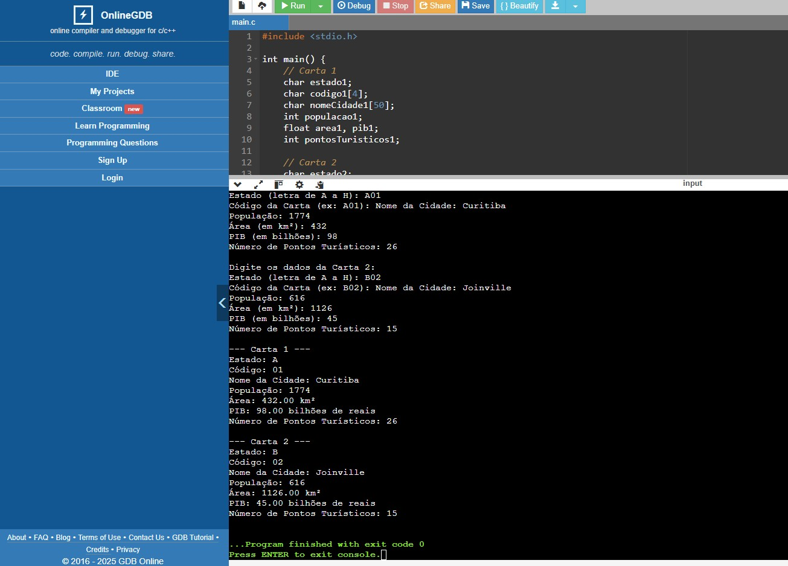
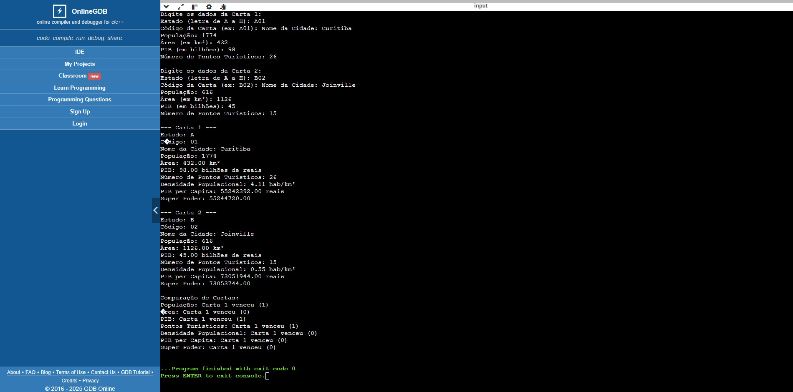

# Super Trunfo - Cadastro de Cartas (C)

Este projeto é um programa simples em C para cadastrar cartas do jogo Super Trunfo com tema "Países".  
O programa permite registrar informações de duas cartas com dados como estado, código, nome da cidade, população, área, PIB e pontos turísticos.

## Como usar

### Opção 1: Executar online (recomendado para iniciantes)

Você pode testar o programa facilmente online, sem instalar nada, acessando:  
👉 [https://www.onlinegdb.com/online_c_compiler](https://www.onlinegdb.com/online_c_compiler)

1. Acesse o link acima.  
2. Cole o código fonte no editor.  
3. Clique em **Run** para compilar e executar.

### Opção 2: Compilar e rodar localmente (requer GCC)

1. Compile o código usando um compilador C, por exemplo:  
````
gcc super_trunfo.c -o super_trunfo
````

2. Execute o programa:
- No Linux/Mac
````
./super_trunfo
````

- No Windows
````
super_trunfo.exe
````

3. Insira os dados das cartas conforme solicitado.

### Execução do Programa online
## Desafio: nível novato


## Desafio: nível aventureiro e nível mestre


## Observações

Este projeto foi desenvolvido como parte do desafio de programação do curso Análise e Desenvolvimento de Sistemas.

---

## Autor

Suelen Maria Kuminck

---


